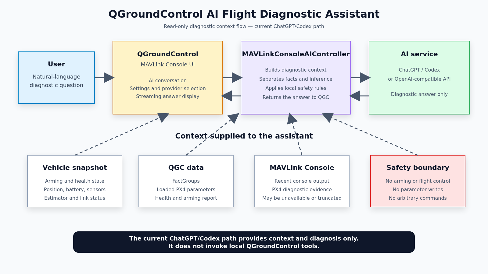
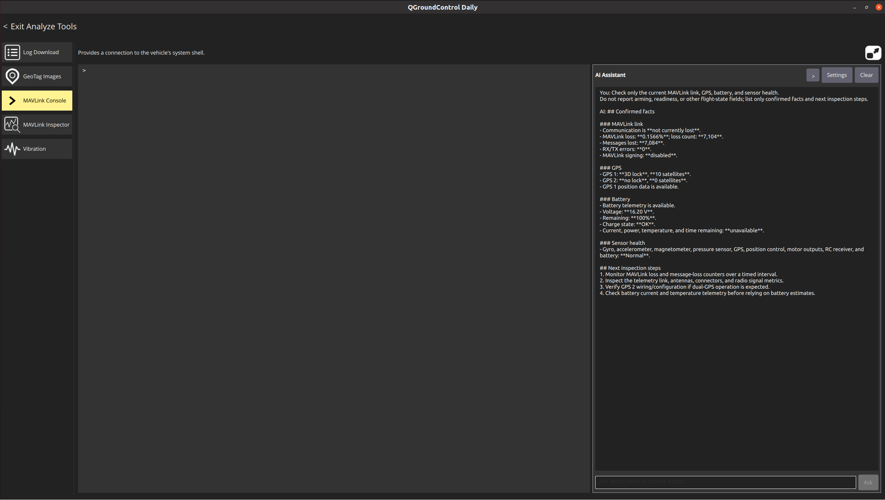

# Building a Safety-Bounded AI Flight Diagnostic Assistant in QGroundControl

> **Prototype history:** This article documents the original MAVLink Console prototype. The implementation has since moved to a dedicated Analyze page. See [the Analyze-view update](AI_ASSISTANT_FORUM_UPDATE_EN.md).

> Technical sharing, experimental feature preview, and request for community feedback


## 1. Background

Many PX4 and QGroundControl issues are not simply questions about which parameter to change. Diagnosing them often requires several sources of information at the same time: vehicle state, sensor status, arming checks, estimator status, MAVLink link health, parameter values, and live PX4 shell or MAVLink Console output.

When these signals are spread across different pages and commands, users have to collect the data manually and then compare it with documentation, forum posts, or search results. This is particularly difficult for people who are new to PX4.

I am therefore experimenting with an AI flight diagnostic assistant integrated into QGroundControl's MAVLink Console. The goal is not to let an AI replace the pilot or control the vehicle. The goal is to let the AI work with the context already available in QGroundControl, organize the evidence, explain the current state, and suggest safe next steps.

## 2. Design goal

The implementation is guided by one principle:

> The AI may help explain the vehicle state, but it must not become an unrestricted executor in the flight-control chain.

Example questions include:

- Why can the vehicle not arm?
- Is the MAVLink link showing packet loss or a communication problem?
- What is the current GPS, battery, estimator, or distance-sensor status?
- What is the current value of a PX4 parameter?
- What does the recent MAVLink Console output indicate?

The assistant prioritizes live QGroundControl telemetry and PX4 diagnostic evidence instead of guessing from generic knowledge alone.

## 3. Current capabilities

The AI Assistant is integrated into the MAVLink Console page. When the user asks a question, QGroundControl can provide the AI with:

- A snapshot of the active vehicle
- Structured telemetry from QGroundControl FactGroups
- Loaded PX4 parameters and their descriptions
- Health and arming-check reports
- MAVLink link, communication-loss, and packet-loss status
- Recent MAVLink Console output
- Restricted query results generated for a specific PX4 diagnostic question

The OpenAI-compatible API path supports experimental controlled tool calls. The current tools include:

- Reading vehicle status and FactGroups
- Reading or searching PX4 parameters
- Reading the health report
- Reading MAVLink link status
- Querying restricted PX4 sensor status
- Requesting one whitelisted MAVLink data message
- Temporarily requesting a message stream rate for a limited time

Reading status, FactGroups, loaded parameters, the health report, and link status are local read-only queries. `REQUEST_MESSAGE` and temporary `SET_MESSAGE_INTERVAL` are limited to whitelisted data; the user must explicitly approve either request before QGroundControl sends it to the vehicle.

The two AI service paths must be distinguished:

1. With an OpenAI-compatible API that supports structured tool calls, the AI can request these controlled tools; QGroundControl still validates every tool request locally.
2. With ChatGPT/Codex App Server sign-in, the current implementation sends vehicle status and Console context as a read-only turn and receives a diagnostic answer. It does not request local QGroundControl tools or display a local tool-approval dialog.

## 4. Architecture and data flow



The current implementation can be summarized as follows:

```text
User question
    ↓
QGroundControl MAVLink Console page
    ↓
MAVLinkConsoleAIController
    ├── Active Vehicle snapshot
    ├── FactGroups, parameters, health and link status
    ├── Recent MAVLink Console output
    ├── PX4 diagnostic evidence builder
    ├── ChatGPT/Codex path: context and diagnostic answer only
    └── OpenAI-compatible API path: whitelisted tool executor
            ↓
      Controlled tool results on the API path, or a read-only ChatGPT/Codex answer
```

Figure 2 shows the current read-only ChatGPT/Codex diagnostic flow: QGroundControl provides vehicle status and MAVLink Console output to the AI, and the AI only returns an analysis. It cannot invoke local QGroundControl tools or control the vehicle.

For an OpenAI-compatible API that supports tool calling, the AI can only request whitelisted diagnostic data. Before a request is executed, QGroundControl validates the tool type, arguments, vehicle state, and command contents locally; user approval is also required when applicable. Requests that violate these rules are rejected, so the AI cannot change parameters or perform flight-control actions.

## 5. Example of PX4 diagnostic evidence



> Figure 3 shows a SITL diagnostic conversation on the read-only ChatGPT/Codex path. Using status context supplied by QGroundControl, the assistant summarizes MAVLink link, GPS, battery, and sensor health, then provides safe next inspection steps.

The broader design goal is to separate diagnostic evidence into layers rather than draw a conclusion from a single status field. For a PX4 question, the AI should distinguish direct observations, different data sources, configuration state, runtime state, and health state.

The current diagnostic flow tries to separate:

1. Direct observations confirmed by QGroundControl;
2. Different evidence sources, including sensors, estimators, links, and health checks;
3. Configuration state versus actual runtime state;
4. What GPS, navigation, and arming checks can and cannot prove;
5. Evidence that is missing, stale, or currently unavailable.

The assistant should distinguish confirmed facts, likely causes, and information that cannot currently be confirmed. Unknown information should not be presented as a confirmed fault.

## 6. Tool execution and safety boundaries

Safety boundaries are a central part of this project. The AI Assistant is explicitly prevented from:

- Arming or disarming the vehicle
- Taking off, landing, or moving the vehicle
- Changing flight modes
- Setting or resetting parameters
- Disabling safety checks
- Calibrating sensors or running actuator tests
- Modifying missions, geofences, or rally points
- Executing arbitrary shell or MAVLink commands

This article focuses on the current read-only ChatGPT/Codex App Server path. It receives vehicle status and MAVLink Console context and returns a diagnostic answer; it does not request local QGroundControl tools, send MAVLink write operations, or perform vehicle actions.

For the controlled-tool OpenAI-compatible API path, any PX4 Console or MAVLink diagnostic operation that would send a request to the vehicle is limited to PX4 vehicles and is rejected locally when the vehicle is armed, flying, or communication is lost. `REQUEST_MESSAGE` and temporary `SET_MESSAGE_INTERVAL` also require explicit in-app user approval before they are sent.

## 7. AI service configuration and data boundary


The current settings provide two configuration paths with different tool capabilities:

1. An API key and an OpenAI-compatible Chat Completions endpoint. This path currently supports experimental controlled tool calls, constrained by a local whitelist, vehicle-state checks, and user approval where required;
2. ChatGPT sign-in through a local Codex App Server, followed by model selection. The current path sends status context and receives a diagnostic answer, but does not request local QGroundControl tools or approvals.

When a remote AI service is used, the active vehicle state, recent Console content, and relevant diagnostic results become part of the request context sent to the selected service. Users should decide whether to enable a cloud service based on their network environment, data sensitivity, and the applicable service terms.

The prebuilt package will not contain an API key, ChatGPT login state, or personal configuration. For testing, use a dedicated test account and avoid entering secrets, internal addresses, or other data that should not be sent to an external service into the Console.

## 8. Experimental build and source code

This is an experimental QGroundControl branch, not an official QGroundControl release.

Source branch:

<https://github.com/amovlgf/qgroundcontrol/tree/ai/mavlink-console-assistant-v5.0.8>

Commit corresponding to this article:

```text
e561057133ffeb9d735710758c11fb6320ffbe09
```

Prebuilt test build:

<https://github.com/amovlgf/qgroundcontrol/releases/tag/v5.0.8.1-ai.1>

The prebuilt package is clearly labeled:

> Experimental / Unofficial build

The Release provides the source commit, target operating systems, known limitations, and package checksums. Users can return to an official QGroundControl release at any time.

## 9. Test environment and current limitations

The current test environment and verified scope are:

| Item | Information |
| --- | --- |
| QGroundControl commit | `e561057133ffeb9d735710758c11fb6320ffbe09` |
| QGroundControl base version | `v5.0.8.1` |
| PX4 version | `v1.18.0alpha` |
| Test method | SITL |
| Operating system | Windows 11, Ubuntu |
| AI service and access path | ChatGPT, signed in through the local Codex App Server |
| Verified scenarios | Read-only SITL flight-status diagnosis through the ChatGPT/Codex path, with Chinese and English questions |
| Known issues | The ChatGPT/Codex path receives only the vehicle status and MAVLink Console context supplied by QGroundControl and generates diagnostic suggestions; it does not invoke local tools, write parameters, or control the vehicle; requests may show `AI request timed out.`; some diagnostics remain unknown when raw Console output is unavailable; AI conclusions still require human verification |

Current limitations include:

- This is experimental functionality; AI conclusions do not replace pilot judgment or the official PX4 documentation.
- The low-privilege MAVLink tools currently target PX4 diagnostic scenarios.
- Network failures, unavailable AI services, or missing context reduce the quality of the answer.
- Requests may show `AI request timed out.` when the network is unstable, the service responds slowly, or model generation takes too long; retry after checking the connection and service status.
- The AI does not automatically modify parameters or execute flight-control actions.
- The verified scenarios in this article use the read-only ChatGPT/Codex path. The controlled-tool OpenAI-compatible API path remains experimental and requires separate testing.
- Not all PX4 sensors, estimators, and vehicle types are covered.
- The stability and platform coverage of any prebuilt package still require additional testing.

## 10. Questions for the community

I would appreciate feedback from the QGroundControl and PX4 communities on the following questions:

1. Does placing this kind of AI diagnostic assistant in the MAVLink Console fit the existing user workflow?
2. Which PX4 diagnostic scenarios should be prioritized next?
3. For the controlled-tool OpenAI-compatible API path, are the current tool whitelist, vehicle-state restrictions, and approval UI clear enough?
4. Would the community prefer local models, OpenAI-compatible APIs, or another integration approach?
5. If the feature is developed further, would it be appropriate to prepare an RFC or an upstream pull request?

Feedback on the architecture, user experience, safety boundary, and PX4 diagnostic semantics is welcome.
