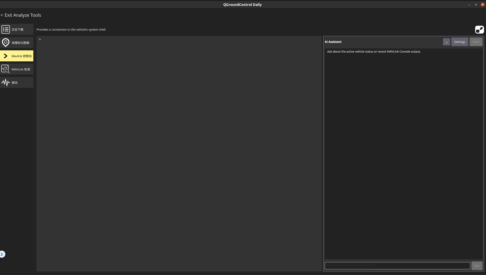
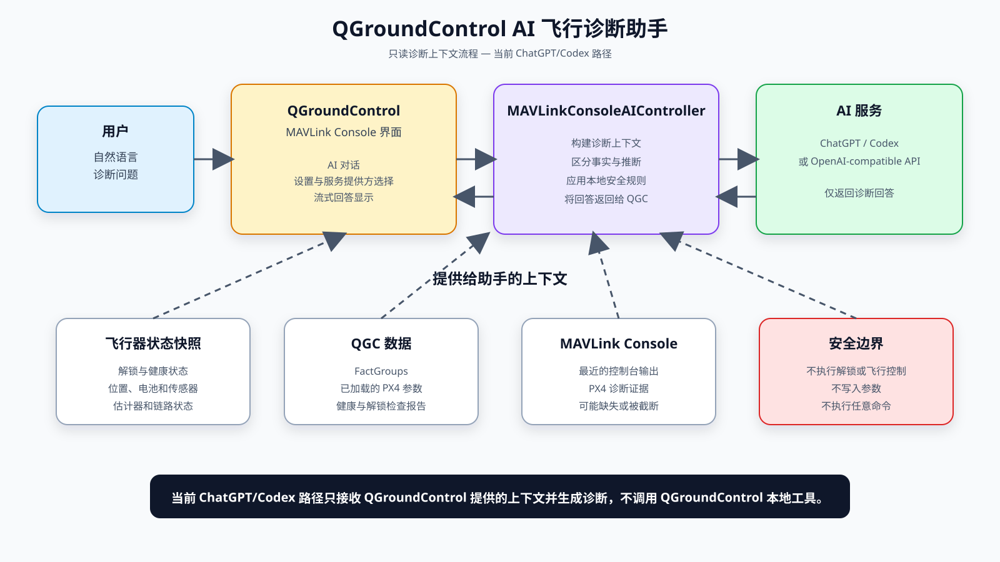
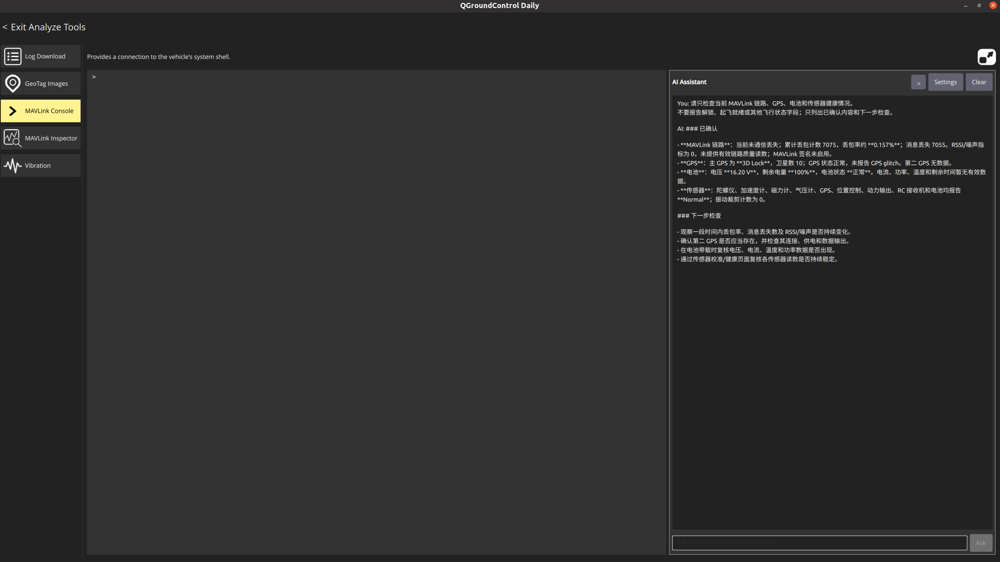
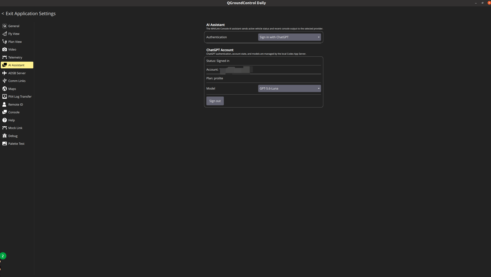
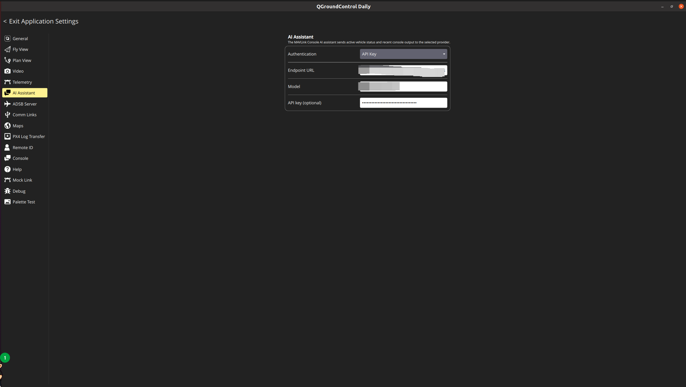

# 在 QGroundControl 中构建一个受安全边界约束的 AI 飞行诊断助手

> **原型历史记录：** 本文记录最初的 MAVLink Console 原型。当前实现已迁移到独立 Analyze 页面，请参阅 [Analyze 页面更新稿](AI_ASSISTANT_FORUM_UPDATE_ZH.md)。

> 技术分享、实验性功能展示与社区征求意见




## 1. 项目背景

在使用 PX4 和 QGroundControl 的过程中，很多问题并不是单纯的“参数应该设置成多少”，而是需要同时观察多个信息来源：当前飞行器状态、传感器状态、解锁检查、估计器状态、MAVLink 链路、参数值，以及 PX4 shell 或 MAVLink Console 的实时输出。

当这些信息分散在不同页面和命令中时，用户往往需要手动收集数据，再到文档、论坛或搜索引擎中交叉验证。对于刚开始接触 PX4 的用户，这个过程尤其困难。

因此，我正在尝试为 QGroundControl 的 MAVLink Console 增加一个 AI 飞行诊断助手。它的目标不是让 AI 代替飞手控制飞行器，而是让 AI 在 QGC 已经掌握的上下文中，帮助用户理解状态、组织证据，并提出下一步安全的排查建议。

## 2. 当前实现的目标

当前版本围绕一个原则设计：

> AI 可以帮助解释飞行器状态，但不能成为飞行控制链路中的不受约束的执行者。

用户可以直接询问例如：

- 为什么当前飞行器无法解锁？
- 当前 MAVLink 链路是否存在丢包或通信异常？
- 当前 GPS、电池、估计器或距离传感器状态如何？
- 某个 PX4 参数当前值是多少？
- 最近的 MAVLink Console 输出说明了什么？

助手会优先使用 QGroundControl 提供的实时数据和 PX4 诊断证据，而不是只根据通用知识猜测。

## 3. 当前实现的核心能力

AI Assistant 已经集成在 MAVLink Console 页面中。用户提出问题时，QGroundControl 可以向 AI 提供以下上下文：

- 当前活动飞行器的状态快照
- QGroundControl FactGroup 中的结构化遥测数据
- 已加载的 PX4 参数及其描述
- 健康检查和解锁检查报告
- MAVLink 链路、通信丢失和丢包状态
- 最近的 MAVLink Console 输出
- 针对特定 PX4 诊断问题生成的受限查询结果

OpenAI-compatible API 路径支持实验性的受控工具调用。当前工具主要包括：

- 读取飞行器状态和 FactGroup
- 读取单个 PX4 参数或搜索参数
- 读取健康检查报告
- 读取 MAVLink 链路状态
- 查询受限的 PX4 传感器状态
- 请求白名单内的一条 MAVLink 数据消息
- 在限定时间内临时请求某条 MAVLink 消息的发送频率

其中，读取状态、FactGroup、已加载参数、健康报告和链路状态属于本地只读查询。`REQUEST_MESSAGE` 与临时 `SET_MESSAGE_INTERVAL` 仅能请求白名单内的数据；在向飞行器发送这两类请求前，必须由用户明确确认。

两种 AI 服务路径必须明确区分：

1. 使用支持 structured tool calls 的 OpenAI-compatible API 时，AI 可以请求上述受控工具；所有工具仍由 QGroundControl 在本地校验。
2. 通过 ChatGPT/Codex App Server 登录时，当前实现只向服务发送飞行器状态和 Console 上下文，并接收诊断回答；该路径不请求 QGroundControl 本地工具，也不会显示本地工具确认界面。

## 4. 系统架构与数据流



当前实现可以概括为以下几层：

```text
用户问题
    ↓
QGroundControl MAVLink Console 页面
    ↓
MAVLinkConsoleAIController
    ├── 当前 Vehicle 状态快照
    ├── FactGroup、参数、健康检查和链路状态
    ├── 最近的 MAVLink Console 输出
    ├── PX4 诊断证据构建器
    ├── ChatGPT/Codex 路径：仅发送上下文并接收诊断回答
    └── OpenAI-compatible API 路径：白名单工具执行器
            ↓
      API 路径中的受控工具结果或 ChatGPT/Codex 只读回答
```

图 2 展示的是当前 ChatGPT/Codex 的只读诊断流程：QGroundControl 将飞行器状态和 MAVLink Console 输出提供给 AI，AI 只返回分析结果，不能调用 QGroundControl 本地工具或控制飞行器。

对于支持工具调用的 OpenAI-compatible API，AI 只能提出白名单内的诊断数据请求。请求执行前，QGroundControl 会在本地检查工具类型、参数、飞行器状态和命令内容；需要时还会要求用户确认。不符合规则的请求会被直接拒绝，因此 AI 无法修改参数或执行飞行控制操作。

## 5. PX4 诊断证据示例



> 图片 3 展示了 ChatGPT/Codex 只读路径下的 SITL 诊断对话：AI 根据 QGroundControl 提供的状态上下文，归纳 MAVLink 链路、GPS、电池和传感器健康情况，并列出下一步检查建议。

这里更重要的不是某一个具体传感器，而是诊断证据的分层方式。对于一个 PX4 问题，AI 需要区分直接观测、不同数据来源、配置状态、运行状态以及健康状态。

当前诊断会尽量分别关注：

1. QGroundControl 已确认的直接观测；
2. 传感器、估计器、链路和健康检查等不同数据来源；
3. 配置状态与实际运行状态；
4. GPS、导航和解锁检查能够说明什么，以及不能说明什么；
5. 当前缺失、过期或无法获得的证据。

助手需要把回答区分为“已确认”“可能原因”和“当前无法确认的信息”，避免把未知信息直接当成故障结论。

## 6. AI 工具调用与安全边界

安全边界是这个项目的核心部分。当前 AI Assistant 明确禁止以下行为：

- 解锁或上锁
- 起飞、降落或移动飞行器
- 切换飞行模式
- 修改或重置参数
- 禁用安全检查
- 执行传感器校准或执行器测试
- 修改任务、地理围栏或返航点
- 执行任意 Shell 命令或任意 MAVLink 命令

本文聚焦当前 ChatGPT/Codex App Server 的只读诊断路径。该路径只接收飞行器状态和 MAVLink Console 上下文并返回分析，不向 QGroundControl 请求本地工具，也不执行 MAVLink 写入或飞行器动作。

对于 OpenAI-compatible API 的受控工具路径，任何需要向飞行器发送 PX4 Console 或 MAVLink 诊断请求的操作，都只支持 PX4 飞行器；当飞行器已解锁、正在飞行或通信已经丢失时，会被本地拒绝。`REQUEST_MESSAGE` 和临时 `SET_MESSAGE_INTERVAL` 还需要用户在界面中明确确认后才会发送。

## 7. AI 服务配置与数据边界





当前设置提供两种配置路径，但两者的工具能力不同：

1. 使用 API Key 和 OpenAI-compatible Chat Completions Endpoint。该路径当前支持实验性的受控工具调用，工具仍受本地白名单、状态检查和用户确认机制约束；
2. 通过本地 Codex App Server 登录 ChatGPT，并选择可用模型。当前该路径用于发送状态上下文并接收诊断回答，不请求 QGroundControl 本地工具或审批。

当使用远程 AI 服务时，活动飞行器状态、最近的 Console 内容以及相关诊断结果会作为请求上下文发送给用户选择的服务。用户在实际使用前，应根据自己的网络环境、数据敏感性和服务条款决定是否启用云端服务。

预编译版本不会内置 API Key、ChatGPT 登录状态或个人配置。测试时建议使用专门的测试账号，并避免在 Console 中输入密钥、内部地址或其他不应发送给外部服务的信息。

## 8. 实验性版本与代码

当前实现是 QGroundControl 的实验性分支，不是官方 QGroundControl 发布版本。

源码分支：

<https://github.com/amovlgf/qgroundcontrol/tree/ai/mavlink-console-assistant-v5.0.8>

当前文章对应的代码提交：

```text
e561057133ffeb9d735710758c11fb6320ffbe09
```

预编译测试版本（如已发布）：

<https://github.com/amovlgf/qgroundcontrol/releases/tag/v5.0.8.1-ai.1>

如提供预编译包，将明确标注为：

> Experimental / Unofficial build（实验性 / 非官方版本）

## 9. 测试环境与当前限制

当前测试环境与已验证范围如下：

| 项目 | 信息 |
| --- | --- |
| QGroundControl commit | `e561057133ffeb9d735710758c11fb6320ffbe09` |
| QGroundControl 基础版本 | `v5.0.8.1` |
| PX4 版本 | `v1.18.0alpha` |
| 测试方式 | SITL |
| 操作系统 | Windows 11、Ubuntu |
| AI 服务与接入路径 | ChatGPT（通过本地 Codex App Server 登录） |
| 已验证场景 | ChatGPT/Codex 路径下的 SITL 飞行状态只读诊断，已验证中文和英文提问 |
| 已知问题 | ChatGPT/Codex 路径仅接收 QGroundControl 提供的飞行器状态和 MAVLink Console 上下文，并生成诊断建议；不执行本地工具调用、参数写入或飞行控制操作；请求可能显示 `AI request timed out.`；缺少原始 Console 输出时，部分诊断只能标记为未知；AI 结论仍需人工验证 |

当前版本仍有以下限制：

- 这是实验性功能，AI 结论不能替代飞手判断或 PX4 官方文档；
- 低权限 MAVLink 工具目前面向 PX4 诊断场景；
- AI 服务不可用、网络中断或上下文缺失时，回答能力会受影响；
- 在网络、服务端响应较慢或模型生成时间较长时，请求可能显示 `AI request timed out.`，当前需要检查连接和服务状态后重试；
- AI 不会自动修改参数或执行飞行控制操作；
- 本文的已验证场景是 ChatGPT/Codex 只读路径；OpenAI-compatible API 的受控工具路径仍属于实验性能力，需要单独测试；
- 尚未覆盖所有 PX4 传感器、估计器和飞行器类型；
- 预编译版本的稳定性和平台覆盖范围需要进一步测试。

## 10. 希望听到社区意见的问题

我希望了解 QGroundControl 和 PX4 社区对以下问题的看法：

1. 将这类 AI 诊断助手放在 MAVLink Console 中，是否符合用户的操作习惯？
2. 哪些 PX4 诊断场景最值得优先支持？
3. 对于 OpenAI-compatible API 的受控工具路径，当前的工具白名单、飞行状态限制和用户确认界面是否足够清晰？
4. 社区更倾向于本地模型、OpenAI-compatible API，还是其他集成方式？
5. 如果继续完善，这类功能是否适合整理为 RFC 或上游 Pull Request？

欢迎提出架构、用户体验、安全边界和 PX4 诊断语义方面的建议。
