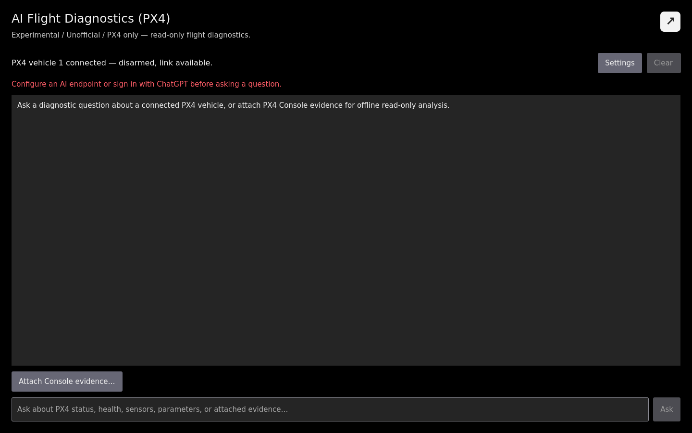
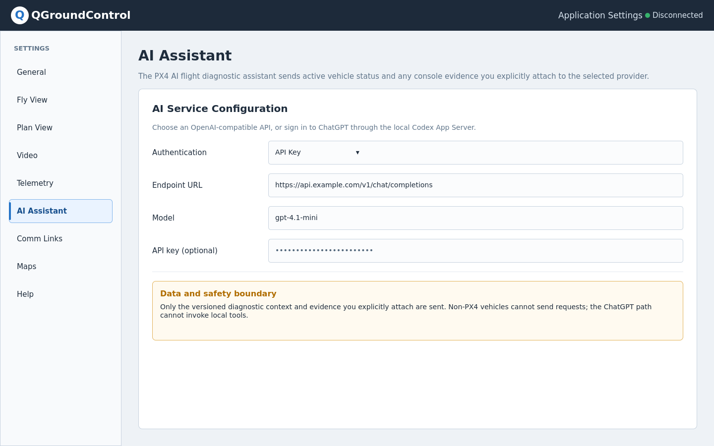
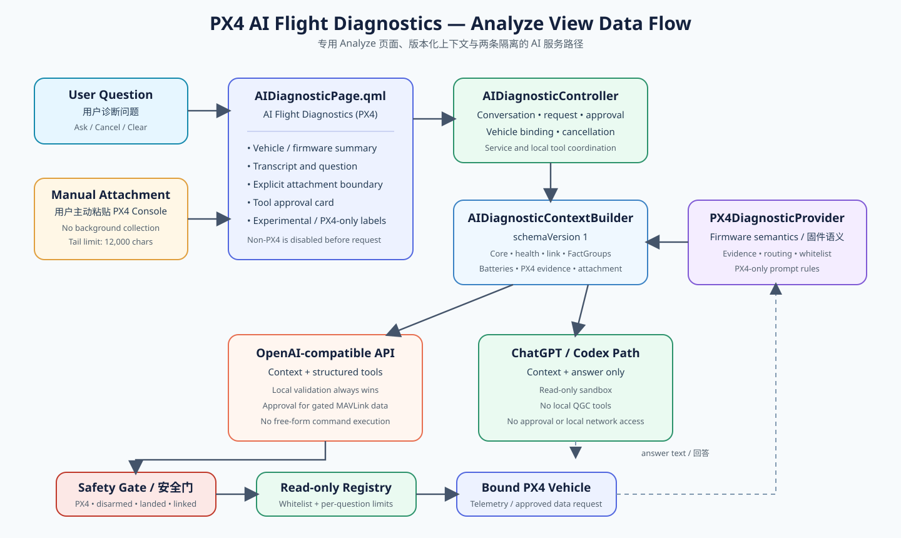
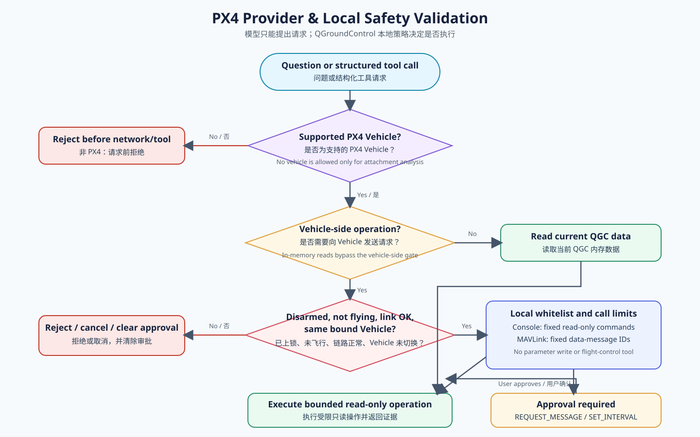

# AI Flight Diagnostics (PX4)

> **Experimental / Unofficial / PX4 only:** This assistant is not part of an official QGroundControl release, does not replace the PX4 documentation or pilot judgement, and must not be used as an authority for flight safety.

_AI Flight Diagnostics_ is a dedicated Analyze tool for explaining PX4 vehicle state, health information, selected read-only diagnostic evidence, and PX4 Console text that you explicitly attach.

## Open the page

1. Open the QGroundControl application menu.
2. Select **Analyze Tools**.
3. Select **AI Flight Diagnostics (PX4)**.

The compact status row shows whether a vehicle is connected, whether it is PX4, and its armed and link state.

A connected ArduPilot or other non-PX4 vehicle disables diagnosis. QGroundControl does not send an AI request and does not offer local tools in that state.

## Configure an AI service

Select **Settings** on the diagnostics page, or open **Application Settings > AI Assistant**.

Two service paths are available:

- **OpenAI-compatible API:** Enter a Chat Completions endpoint, model name, and optional API key. Endpoints that support structured tool calls may request QGroundControl's restricted diagnostic tools.
- **Sign in with ChatGPT:** Complete device-code sign-in and select a model. This path receives the supplied context and returns text only; it cannot invoke QGroundControl local tools.

Existing experimental-build settings are retained during the rename from AI Console settings.

## Ask a question

With a connected PX4 vehicle, enter a focused diagnostic question and select **Ask**. Useful examples include:

- Why is this vehicle not ready to arm?
- Is the MAVLink link reporting loss?
- Is external-vision input present, configured, and fused?
- What is the currently loaded value of EKF2_EV_CTRL?

The assistant separates direct observations from likely causes and missing evidence. Select **Cancel** to stop a request, or **Clear** to remove the conversation and attached Console evidence.

## Attach PX4 Console evidence

Select **Attach Console evidence…** and paste only the text you want to send. QGroundControl does not collect the MAVLink Console in the background and does not share a shell session with this page.

Before sending:

- Remove secrets, identifiers, internal addresses, and unrelated output.
- Verify that the output came from the PX4 vehicle relevant to the question.
- Note that only the final 12,000 characters are sent; longer input is tail-truncated.

With no connected vehicle, a question is allowed only when an attachment is present. This attachment-only mode disables every local vehicle tool. A connected non-PX4 vehicle disables diagnosis even if text is attached.

## Tool confirmation and safety limits

The OpenAI-compatible path has a fixed local tool registry. Status, health, loaded parameter, FactGroup, and link reads are read-only. Restricted PX4 Console queries also use a command whitelist and per-question limit.

REQUEST_MESSAGE and temporary SET_MESSAGE_INTERVAL always show an approval card before anything is sent to the vehicle. Check the requested message, target, duration, and risk, then select **Approve** or **Reject**.

PX4 Console and low-privilege MAVLink requests are refused while the vehicle is armed, flying, or communication is lost. A request is bound to the vehicle active when it starts; switching or disconnecting that vehicle cancels the request and clears pending approval.

The assistant cannot write parameters, change modes, calibrate sensors, modify missions, run actuator tests, arm, disarm, take off, land, or execute arbitrary shell or MAVLink commands.

## Data sent to the selected service

Depending on availability, the versioned diagnostic context can contain:

- Active-vehicle identity, firmware, armed/flight state, mode, position, and readiness state
- Sensor summary, health and arming checks, link counters, and packet-loss information
- QGroundControl FactGroups and battery groups
- Relevant loaded PX4 parameters and provider-generated diagnostic evidence
- Console evidence explicitly pasted into the attachment field
- The question and limited conversation history

The API key path may additionally send results from approved or automatically allowed read-only tools. The ChatGPT path never invokes those local tools.

## Troubleshooting

- **Ask is disabled:** Configure a service, connect a PX4 vehicle, or—when no vehicle is connected—paste PX4 Console evidence.
- **Unsupported firmware:** Disconnect the non-PX4 vehicle. Phase one intentionally supports PX4 only.
- **Request timed out:** Check the endpoint, network, selected model, and service availability, then retry.
- **Tool was refused:** Disarm and land the vehicle, restore communication, and verify that the requested command or MAVLink message is on the whitelist.
- **Evidence is unknown:** Confirm that QGroundControl has received the required telemetry or parameter set, or attach a current read-only PX4 Console result.

