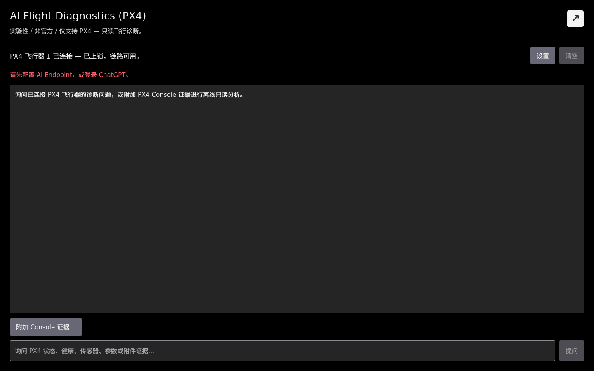

# AI 飞行诊断（PX4）

> **实验性 / 非官方 / 仅支持 PX4：** 本助手不属于 QGroundControl 官方发布版本，不能替代 PX4 官方文档、飞手判断或飞行安全流程。

_AI 飞行诊断_ 是独立的 Analyze 工具，用于解释 PX4 飞行器状态、健康信息、受限的只读诊断证据，以及用户主动附加的 PX4 Console 文本。

## 打开页面

1. 打开 QGroundControl 应用菜单。
2. 选择 **分析工具**。
3. 选择 **AI Flight Diagnostics (PX4)**。

紧凑状态栏会显示飞行器连接、PX4 固件、解锁状态和链路状态。

连接 ArduPilot 或其他非 PX4 飞行器时，诊断会被禁用；QGroundControl 不会发送 AI 请求，也不会提供本地工具。

## 配置 AI 服务

点击诊断页面中的 **Settings**，或打开 **应用设置 > AI Assistant**。

支持两种服务路径：

- **OpenAI-compatible API：** 填写 Chat Completions Endpoint、模型名称和可选 API Key。支持 structured tool calls 的 Endpoint 可以请求 QGroundControl 的受限诊断工具。
- **使用 ChatGPT 登录：** 完成设备码登录并选择模型。该路径只接收已提供的上下文并返回文本，不能调用 QGroundControl 本地工具。

从旧实验版本升级时，原 AI Console 设置中的 Endpoint、模型和 API Key 会继续保留。

## 提问

连接 PX4 飞行器后，输入明确的诊断问题并点击 **Ask**。例如：

- 为什么当前不能解锁？
- MAVLink 链路是否存在丢包？
- 外部视觉输入是否到达、已配置并实际参与融合？
- 当前加载的 EKF2_EV_CTRL 值是多少？

助手会区分直接观测、可能原因和缺失证据。点击 **Cancel** 停止请求；点击 **Clear** 清空对话及已附加的 Console 证据。

## 附加 PX4 Console 证据

点击 **附加 Console 证据…**，只粘贴希望发送的文本。QGroundControl 不会在后台采集 MAVLink Console，也不会与本页面共享 Shell 会话。

发送前请注意：

- 删除密钥、标识符、内部地址和无关输出。
- 确认输出来自当前问题对应的 PX4 飞行器。
- 最多发送末尾 12,000 个字符；更长内容会从前部截断。

未连接飞行器时，只有附加证据后才能提问，并且所有本地飞行器工具均被禁用。连接非 PX4 飞行器时，即使附加文本也不能诊断。

## 工具确认与安全限制

OpenAI-compatible 路径使用固定的本地工具注册表。状态、健康报告、已加载参数、FactGroup 和链路查询均为只读；PX4 Console 查询还受命令白名单和单次问题调用次数限制。

REQUEST_MESSAGE 和临时 SET_MESSAGE_INTERVAL 在向飞行器发送前始终显示确认卡片。用户应检查消息类型、目标、持续时间和风险，再选择 **Approve** 或 **Reject**。

飞行器已解锁、正在飞行或通信丢失时，PX4 Console 与低权限 MAVLink 请求会被拒绝。请求会绑定开始时的活动 Vehicle；切换或断开该飞行器会取消请求并清除待审批动作。

助手不能写入参数、切换模式、执行校准、修改任务、运行执行器测试、解锁、上锁、起飞、降落，也不能执行任意 Shell 或 MAVLink 命令。

## 会发送给所选 AI 服务的数据

根据 QGroundControl 当前的数据可用性，版本化诊断上下文可能包含：

- 活动飞行器标识、固件、解锁/飞行状态、模式、位置和就绪状态
- 传感器摘要、健康与解锁检查、链路计数及丢包信息
- QGroundControl FactGroup 与电池数据组
- 相关的已加载 PX4 参数和 Provider 生成的诊断证据
- 用户主动粘贴到附件框中的 Console 证据
- 当前问题和有限的对话历史

API Key 路径还可能发送用户已批准或本地自动允许的只读工具结果。ChatGPT 路径不会调用这些本地工具。

## 故障排查

- **Ask 不可用：** 先配置服务并连接 PX4；未连接飞行器时，需要粘贴 PX4 Console 证据。
- **Unsupported firmware：** 断开非 PX4 飞行器。第一阶段有意只支持 PX4。
- **请求超时：** 检查 Endpoint、网络、所选模型与服务可用性后重试。
- **工具被拒绝：** 确认飞行器已上锁且落地、通信正常，并确认命令或 MAVLink 消息位于白名单内。
- **证据为 unknown：** 确认 QGroundControl 已收到所需遥测或参数，或主动附加最新的只读 PX4 Console 输出。

